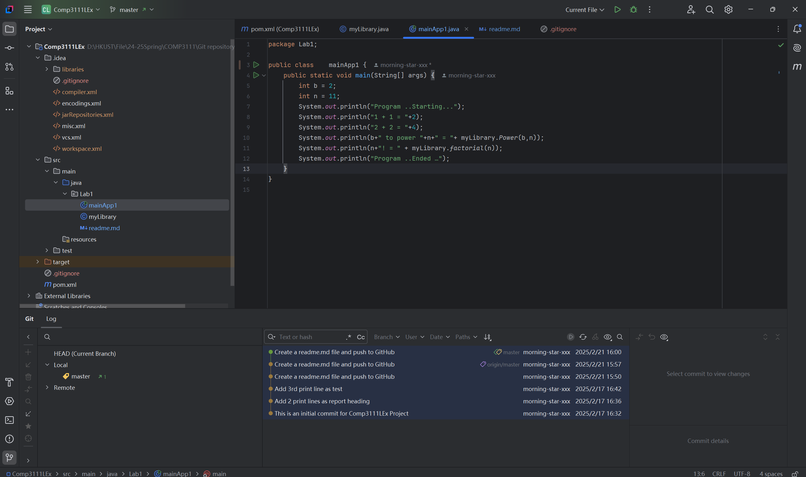

# Create a readme.md file for comp3111 lab1
Adding some comments to fulfill the requirement of lab1.

In Lab1, I learnt how to build a Java project in IntelliJ and how to push it to GitHub.

Here is the screenshot for the first lab.
